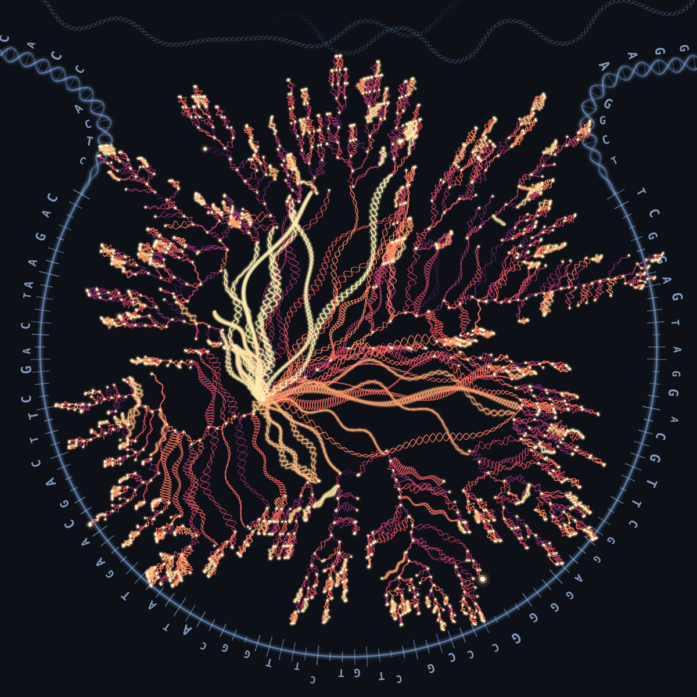

# GPC: An expressive and tractable deep generative model for genetic variation data

<p align="center">
  <picture>
    <source media="(prefers-color-scheme: dark)" srcset="assets/clt_tree.png">
    <source media="(prefers-color-scheme: light)" srcset="assets/clt_tree_light.png">
    
  </picture>
</p>

**GPC** (Genetic Probabilistic Circuit) is a tractable deep generative model for haplotype data. It supports exact likelihood evaluation, exact marginalization, and fast conditional queries. The same trained model can generate artificial genomes and impute missing SNPs.

Preprint: [GPC: An expressive and tractable deep generative model for genetic variation data (bioRxiv, 2026)](https://www.biorxiv.org/content/10.1101/2023.05.16.541036v3).

---

## Installation

```bash
git clone https://github.com/sriramlab/GPC.git
cd GPC

pip install pyjuice
```

Requires a CUDA-capable GPU, PyTorch, NumPy, pandas, scikit-learn, networkx, matplotlib, and tqdm. GPC is built on [PyJuice](https://github.com/Tractables/pyjuice).

---

## Data format

A whitespace-separated `0/1` haplotype file with no header: rows = haplotypes, columns = SNPs. Genotypes must be phased and split into haplotypes, so a diploid cohort contributes two rows per individual. Columns should be a contiguous genomic region in position order — the Chow–Liu backbone learns from linkage disequilibrium between neighbouring SNPs, so a randomly ordered or randomly sampled set of SNPs will train but produce a poor model.

Optionally, a `.legend` file with header `id position a0 a1` (space-separated) giving the bp position of each SNP. If supplied, LD plots use bp distance on the x-axis.

`pc/demo/` ships two files from a contiguous chr15 region in 1000 Genomes Project Phase 3 (5008 haplotypes):

| File | SNPs | Use for |
|---|---|---|
| `1K_full.txt` + `1K_full.legend`   | 1,000  | default — fast end-to-end run |
| `10K_full.txt` + `10K_full.legend` | 10,000 | full run |

---

## Quick start (1K SNPs, ~ a few minutes on one GPU)

From `pc/demo/`, run the four steps in order. Every script shares one `--run-dir` (default `out/1K`).

```bash
cd pc/demo

# 1. Train a GPC with train/val/test split and early stopping.
python3 train_demo.py

# 2. Sample artificial genomes from the best checkpoint.
python3 generate_demo.py

# 3. Evaluate sample quality + privacy: PCA, LD decay, LD error, CLT tree, AATS.
python3 evaluate.py

# 4. Imputation benchmark: single-SNP + multi-SNP at 30/50/80% missingness.
python3 impute_demo.py
python3 plot_imputation.py
```

Afterwards `out/1K/` contains:

```
out/1K/
├── config.json
├── gpc_best.jpc                   best-val GPC checkpoint
├── train.txt / val.txt / test.txt shuffled splits (reused downstream)
├── train.log                      per-epoch train/val LL
├── samples.txt                    generated haplotypes
├── quality/                       pca, ld_decay, ld_error, clt_tree, clt_summary
├── imputation/                    r2 CSVs + imputation_r2.pdf + imputation_summary.csv
└── privacy/                       aats
```

All scripts take `--help`.

## Full run (10K SNPs)

Same four steps, bigger model:

```bash
cd pc/demo

python3 train_demo.py      --data 10K_full.txt --output-dir out/10K \
    --latents 128 --epochs 2000 --patience 100 --seed 1
python3 generate_demo.py   --run-dir out/10K --num-samples 5008 --seed 1
python3 evaluate.py        --run-dir out/10K --legend 10K_full.legend --seed 1
python3 impute_demo.py     --run-dir out/10K --mask-rates 0.3 0.5 0.8 --seed 1
python3 plot_imputation.py --run-dir out/10K
```

## Using your own data

```bash
python3 train_demo.py --data path/to/haps.txt --output-dir out/my_run \
    --latents 128 --epochs 2000 --patience 100 --seed 1
python3 generate_demo.py   --run-dir out/my_run
python3 evaluate.py        --run-dir out/my_run --legend path/to/haps.legend
python3 impute_demo.py     --run-dir out/my_run
python3 plot_imputation.py --run-dir out/my_run
```

Pass `--legend ''` to `evaluate.py` to fall back to SNP-index distance when no legend is available.

### Choosing settings

| Setting | Guidance |
|---|---|
| `--latents` | 128 is a good default. Larger values cost more memory without improving held-out likelihood; 16 is enough for the 1K demo. |
| `--epochs` / `--patience` | Training stops on held-out log-likelihood, so set these generously and let early stopping decide. |
| Region size | Up to roughly 10,000–15,000 SNPs on a standard workstation. The binding constraint is *host* RAM while the Chow–Liu tree is built, which grows with the square of the number of SNPs — not GPU memory. |
| GPU | One card is enough; the 10K model peaks at about 5 GB of GPU memory. |

To model a longer region, split it into contiguous chunks and train one model per chunk.

---

## Repository layout

```
pc/demo/          self-contained demo (start here)
pc/               training / sampling / imputation scripts
plots/            analysis notebooks and figure-generating scripts
aux/              SNP legends, MAF tables, AATS utilities
impute5/          wrappers for running Impute5 with a reference panel
results/          per-dataset outputs (metrics, VCFs, logs)
```

Model checkpoints (`.jpc`) and raw sample matrices are not tracked: they are large and
regenerated by the scripts above.

`plots/structure/` adopts and extends code from Yelmen et al., *Deep convolutional and conditional neural networks for large-scale genomic data generation* ([PLOS Comput. Biol.](https://journals.plos.org/ploscompbiol/article?id=10.1371/journal.pcbi.1011584)).

---

## Citation

```
@article{anand2026gpc,
  title   = {GPC: An expressive and tractable deep generative model for genetic variation data},
  author  = {Anand, Prateek and Liu, Anji and Dang, Meihua and Fu, Boyang and Wei, Xinzhu and Van den Broeck, Guy and Sankararaman, Sriram},
  journal = {bioRxiv},
  year    = {2026},
  doi     = {10.1101/2023.05.16.541036},
  url     = {https://www.biorxiv.org/content/10.1101/2023.05.16.541036v3}
}
```
